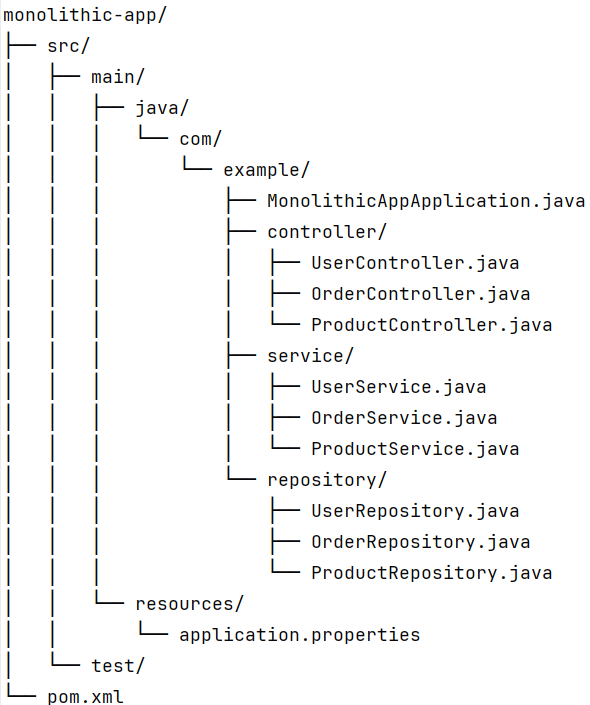
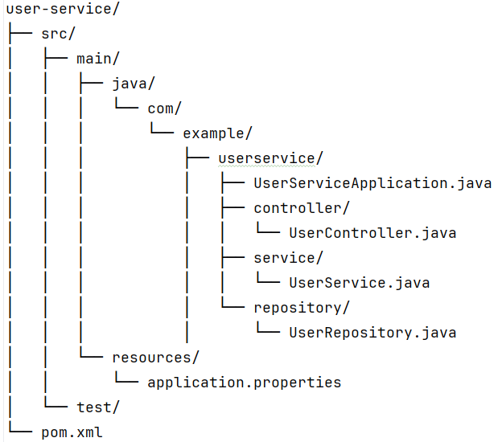

**Monolithic Application Overview**

In the monolithic application, you might have a single Spring Boot project with the following structure:

**Microservices Architecture**

In the microservices architecture, we will split the monolithic application into three 
separate Spring Boot projects. Each microservice will have its own database, and they will communicate 
with each other via REST APIs.

* **UserService**: Handles user-related operations
* **OrderService**: Handles order-related operations between user and product
* **ProductService**: Handles product-related operations

**This is the structure of each Microservice:**

**Key Principles for Database Splitting**
* Database per Service: Each microservice owns its database, and no other service can directly access it.
* Decentralized Data Management: Each service manages its data independently.
* API Communication: Services communicate via REST APIs rather than directly accessing each other's databases.
* Data Consistency: Use eventual consistency and distributed transactions (e.g., Saga pattern) if needed 

We'll use H2 in-memory databases for simplicity, but the same principles apply to 
production databases like MySQL, PostgreSQL, etc.

**Insert test Data into database tables**

-- Insert test data into the 'users' table

INSERT INTO users (id, name, email) VALUES
(1, 'John Doe', 'john.doe@example.com'),
(2, 'Jane Smith', 'jane.smith@example.com')

-- Insert test data into the 'products' table

INSERT INTO products (id, name, price) VALUES
(1, 'Schoko', 7.9),
(2, 'Kuchen', 3.4),
(3, 'Chips', 1.9)

-- Insert test data into the 'orders' table

INSERT INTO orders (id, product_id, user_id, quantity) VALUES
(2, 1, 2, 5)

**Communication Between Microservices**
* OrderService calls UserService to fetch user details using a REST API.
* OrderService does not directly access the UserService database. Instead, it uses the UserService API.

**Running the Example**
Start each microservice (UserService, OrderService, ProductService).
Use the H2 console (enabled in application.properties) to inspect each database:

* UserService: http://localhost:8081/h2-console
* OrderService: http://localhost:8082/h2-console
* ProductService: http://localhost:8083/h2-console

**Test the APIs:**

* UserService: http://localhost:8081/users/1
* OrderService: http://localhost:8082/orders/1
* ProductService: http://localhost:8083/products/1

**Coding Tasks** 

1. Add Open API dependencies to the services and add some test-data 
2. Add any attributes to the data modell and adapt the code of the services 
3. Check the meaning of the Saga pattern theoretically 
4. Add another service to the application and/or configure cloud based databases - task for coding project 

